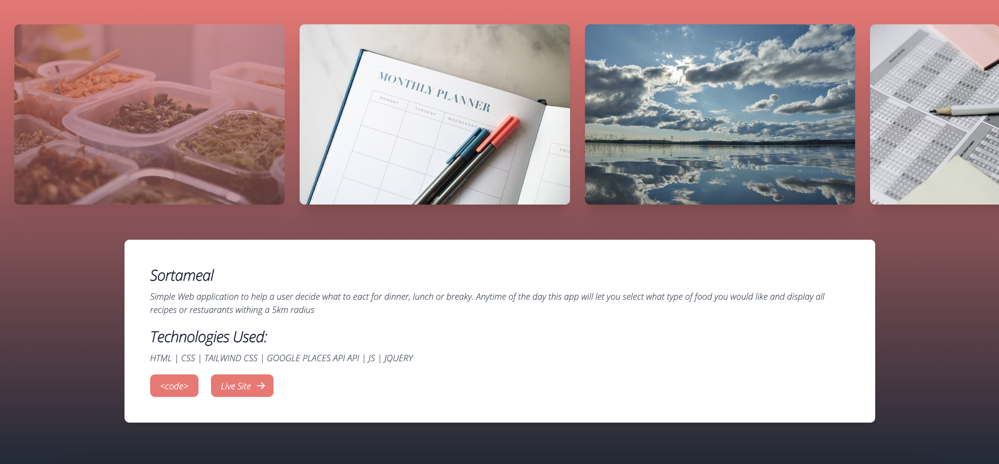

# Week16-Homework

# Portfolio

## Description 

This is my Portfolio website.
Also has a footer at the bottom of the page with contact information
I will be constanly adding to this with my most recent work.
I will also be trying to keep my resume, linkinin and github all up to date.  

## Table of contents 

- [Screenshots](#screenshots) 
- [Technologies](#technologies) 
- [Resources](#resources) 
- [Contact](#contact)
  
## Screenshots 
---
Home

Work

## Technologies
***
A list of technologies used within the project:

- JAVASCRIPT
- HTML
- CSS
- TAILWIND CSS
- 
## Resources

[Github Repo](https://github.com/mckayjalex/portfolio-am)

[Live Site](https://mckayjalex.github.io/portfolio-am/)

## Contact

GitHub: [GitHub](https://github.com/mckayjalex) Email: [alexjosephmckay@gmail.com](alexjosephmckay@gmail.com)